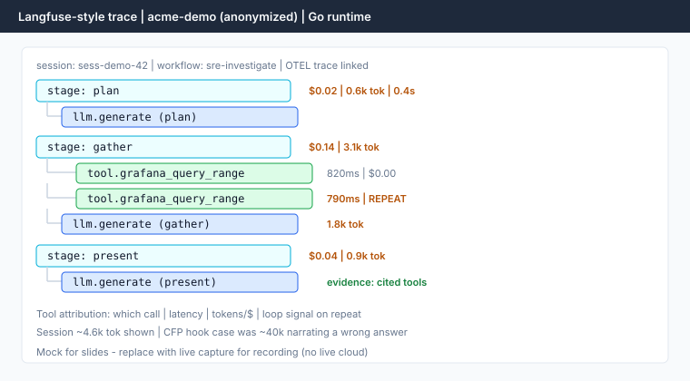
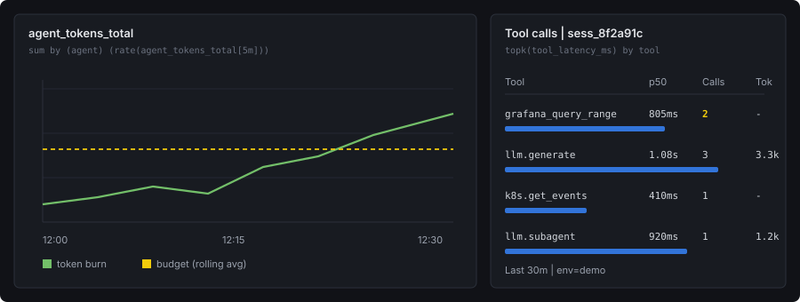
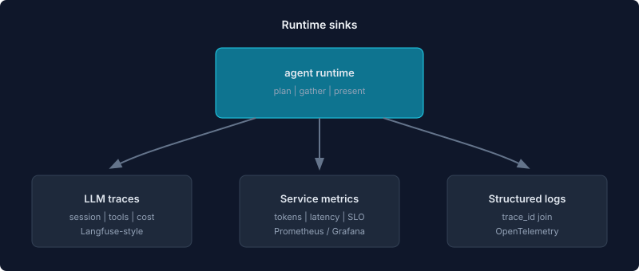

<!-- _class: title-slide -->

# You Can't Debug What You Can't See

## Observability for AI Agents

Sabith K S · Principal Engineer, StackGen  
Conf42 Observability 2026 · September 10, 2026

<!-- SPEAKER 0:45 — CFP: Go agent runtime; slides + example traces; no live cloud -->

---

## The 3 AM page that looked fine

- Agent returned a **plausible RCA** — complete sentences, confident tone
- APM: green latency, no HTTP 5xx, dependency checks passing
- On-call still angry: **wrong service**, repeated work, invoice spike tomorrow

Traditional APM tells you a request was slow.  
It won't tell you an agent **burned 40k tokens narrating a wrong answer.**

<!-- SPEAKER 1:00 — open with the CFP line; gap between green dashboards and human trust -->

---

## Agents don't crash

They fail in ways traditional monitoring rarely names:

- **Loop** on the same tool with minor argument tweaks
- **Burn tokens** while making no progress
- **Hallucinate** a causal story that reads like an RCA
- **Skip evidence** and still sound authoritative

No stack trace. No pod restart. Just a bad outcome at the end.

<!-- SPEAKER 0:50 — contrast with microservice failure modes -->

---

### APM asks

- Is the service up?
- How fast are responses?
- Are there HTTP errors?

### On-call asks

- Why did this task cost **3×** the usual?
- Why the **same tool** five times?
- Did the agent **do** what it claimed?
- Was the answer **grounded** in tool output?

<!-- SPEAKER 1:10 — two-column read; end on groundedness (CFP evidence checks) -->

---

## New primitives agents need

| Primitive | Question it answers |
|-----------|---------------------|
| **Session traces** | What did the agent decide across multi-step reasoning? |
| **Tool attribution** | Which call cost what — tokens, $, latency? |
| **Token budgets** | First-class signal: caps + alerts, not an invoice surprise |
| **Evidence checks** | Was the output grounded — or just fluent? |

Beyond dashboards: **why did this agent do that?**

<!-- SPEAKER 0:55 — CFP thesis slide; rest of talk delivers these four -->

---

## Cost is the canary

- Tight loops burn tokens **geometrically** — invoice arrives before the webhook
- **Token budgets** (iteration limits, per-tool budgets, loop detection) are pre-flight breakers
- **Alerts** on session cost vs rolling average catch slower drift

Alert on cost first. Debug second.

<!-- SPEAKER 0:50 — production invoices, not theory -->

---

## Agenda

1. **Instrument** — plan / gather / present spans, tool cost & latency, evidence
2. **Dual-sink stack** — OpenTelemetry + Langfuse-style LLM tree + metrics panels
3. **When visibility lies** — scorecards on the wrong population
4. **Debug after the fact** — one zip per conversation
5. **Starter set** — what to watch Monday

<!-- SPEAKER 0:30 — roadmap matches CFP deliverables -->

---

<!-- _paginate: false -->

### Act 2 · What we instrument

---

## Pillar 1 — Session traces (plan → gather → present)

Spans that follow the agent through the procedure — not one request span:

| Stage | What the span answers |
|-------|------------------------|
| **Plan** | What did we decide to investigate? |
| **Gather** | Which tools ran, in what order? |
| **Present** | What did we claim — and on what evidence? |

Nested children for model calls, tools, and sub-agents.  
**OpenTelemetry** for session correlation; **Langfuse**-style tree for the LLM path.

<!-- SPEAKER 1:00 — CFP: plan/gather/present; OTEL + Langfuse -->

---

<!-- SPEAKER 1:30 — RECORD Segment A: expand plan→gather→present; call out repeat tool + per-tool $ -->
<!-- Live capture replaces mock before final recording; no live cloud required -->

---

## Pillar 2 — Tool attribution + token budgets

| Signal | Per tool | Per session |
|--------|----------|-------------|
| Cost ($) / tokens | Which call burned the budget? | Is this run 3× normal? |
| Latency | Slow tool vs slow model | Wall-clock for the procedure |
| Repeat count | Loop detection | Hard caps / circuit breakers |

Token budgets are **first-class**: hard caps in the runtime, alerts on the metrics sink.

<!-- SPEAKER 0:55 — CFP: which call cost what + token budgets -->

---

<!-- SPEAKER 0:40 — Grafana/Datadog-style panel; service metrics ≠ LLM span detail -->

---

## Pillar 3 — Evidence checks

Fluent output is not grounded output.

- Did present-stage claims cite **tool results** from gather?
- Soft gates: missing evidence → demote confidence / refuse a pass
- Optional judge / rubric on the debug export — grade the run, not the prose style

**Skip evidence + sound authoritative** is the failure mode APM never names.

<!-- SPEAKER 0:55 — CFP: evidence checks that show whether output was grounded -->

---

## Audit without becoming a secret store

- Append-only record of tool calls and governance decisions
- **Redact before persist** — placeholders, not raw credentials
- Observability that leaks secrets becomes a **liability** in incident review

<!-- SPEAKER 0:35 — one slide; keep short -->

---

## Metrics vs traces

| Use | Sink |
|-----|------|
| Alerting, SLOs, dashboards | Prometheus / Grafana / Datadog-style counters |
| Debugging loops, prompts, tool paths | LLM trace backend (Langfuse-style) |

**Cardinality rule:** tool names and agent names — OK.  
**Session IDs in Prometheus labels — never.**

<!-- SPEAKER 0:50 — war story: cardinality explosion -->

---

<!-- SPEAKER 1:00 — stack: Go runtime → OTEL hops → Langfuse + metrics + logs; wrong sink = false missing traces -->

---

## Correlation that actually works

- Outbound HTTP: **W3C `traceparent`** (OpenTelemetry) on every hop — MCP, gateway, integrations
- Logs: **`traceID`** = OTEL hex — not chi RequestID
- Goal: Grafana **trace → logs** join during incident review

If your logs and traces use different IDs, you don't have correlation — you have hope.

<!-- SPEAKER 0:50 -->

---

<!-- SPEAKER 0:50 — session / workflow / stage / persona on every child span -->

---

<!-- _paginate: false -->

### Act 3 · When visibility lies

---

## The scorecard that lied

| Dimension | Score |
|-----------|-------|
| Reliability | Excellent |
| Correctness | Terrible |
| Efficiency | Terrible |
| Latency | Acceptable |

Correct math. **Wrong population** — mostly helper spans with thin session context.

<!-- SPEAKER 1:00 — almost promoted the wrong fleet -->

---

## Missing data is not a passing grade

| Missing | You cannot conclude |
|---------|---------------------|
| Session identity | Retry rate, loops, session reliability |
| Model + tokens | Cost efficiency / tool attribution |
| Evidence / evaluators | Correctness (groundedness) |
| Workflow stage (plan/gather/present) | Which procedure step failed |

Every score needs a **coverage statement**. Blank panel ≠ healthy engine.

<!-- SPEAKER 1:00 -->

---

## Rule

> **Measure telemetry quality before you measure agent quality.**

Then:

- Stamp **plan / gather / present** at span start
- Attribute cost and latency **per tool**
- Attach evidence checks where correctness matters — unknown ≠ zero

<!-- SPEAKER 0:50 -->

---

<!-- _paginate: false -->

### Act 4 · Debug after the fact

---

## What support actually needs

"This AI investigation went wrong."

They need **one artifact** for the whole conversation — not a scavenger hunt across executions.

<!-- SPEAKER 0:30 — CFP: how we debug a bad session after the fact -->

---

<!-- SPEAKER 1:00 — Segment A recap: open the tree first -->

---

<!-- SPEAKER 1:30 — RECORD Segment B: walk ZIP; mention judge-report / evidence grade -->

---

<!-- SPEAKER 0:50 — before/after; whole conversation in one download -->

---

## Batch grading → product gates

Composite patterns from a week of anonymized exports:

| Pattern | Product response |
|---------|------------------|
| Duplicate digs | Reuse-first launch policy |
| Verdict drift by entry path | Document context; prefer watch links |
| Missed correlate asks | User-goal gates |
| Ungrounded present / truncated preview | Evidence honesty + `return_full` |

<!-- SPEAKER 0:50 — no customer data on slide -->

---

## Starter set — why did this agent do that?

**Screenshot this.** Do two things next week: (1) alert on spend × rolling avg **and** tool-loop count, (2) require present to cite gather.

| Signal | Why |
|--------|-----|
| Session cost vs rolling avg | Token budget / runaway context |
| Per-tool cost + latency | Attribution — which call burned the run |
| Identical consecutive tool calls | Loop detection (often silent in APM) |
| Evidence coverage on present | Groundedness, not fluency |
| Daily token burn vs budget | Invoice surprises |
| Integration / model health | Silent dependency failure |

Industry 2025–26: alert on loop count, not only $, and don’t trust answer text without an evidence path.

<!-- SPEAKER 1:10 — hold for screenshot; say the two Monday actions out loud -->

---

## Five lessons

1. **Token budgets are canaries** — alert before you debug (loop count too)
2. **Session traces follow plan → gather → present** — not one request span
3. **Tool attribution** — which call cost what (tokens, $, latency)
4. **Evidence checks** — fluent ≠ grounded (judges can lie without a trace)
5. **One debug artifact** — whole conversation, after the fact

**Remember:** cost + loop count + grounded present.

<!-- SPEAKER 0:50 — map 1:1 to CFP; say the remember line once -->

---

<!-- _class: title-slide -->

# Thank you

**Write-up:** [productionnotes.dev](https://productionnotes.dev/)  
**StackGen Discord:** [discord.com/invite/GNVmqXjwT](https://discord.com/invite/GNVmqXjwT)  
**CNCF feature:** cncf.io/blog — same title  

Sabith K S · [@sks](https://github.com/sks) · StackGen · Go agent runtime

<!-- SPEAKER 0:35 — say both URLs; Discord for StackGen community -->

---

<!-- _class: title-slide -->

# Questions?

You can't debug what you can't see.

<!-- Buffer slide · ~1 min -->
